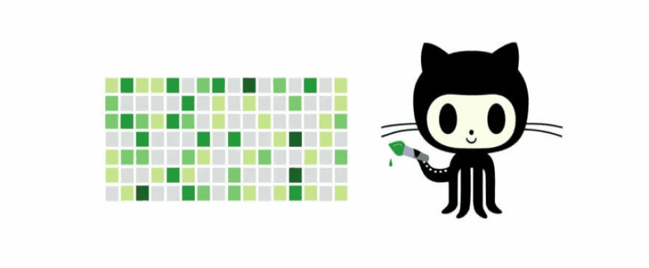
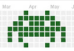
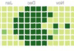

## git-effect

`This project was created to creatively design your Github profile page, namely its working time module. Using this package, you can write a word, date in the working time module or display one of the predefined pictures.`

`Данный проект создан для креативного оформления страницы Вашего профиля Github, а именно ее модуля рабочего времени. С помощью даного пакета Вы можете написать в модуле рабочего времени какое-либо слово, дату или отобразить один из предустановленных рисунков.`

Язык программирования - html, js.
Стек - js, node.js, moment, fs.
Пользовательский интерфейс - сайт.

Подключение:\
In the project directory, you can run: 

### `npm i git-effect`

For using you need require git-effect such as:\
Для создания календаря необходимо подключить пакет в файле js ипользуя:
### `const newEffect = require('git-effect')`
After that you need run your js file such as:\
После подключения передайте желаемый для отображения текст как аргумент в newEffect(), а также желаемый язык календаря (например русский язык - 'ru', параметр необязательный, по умолчанию английский язык):

###`newEffect('your text', 'en')`

File `gitEffect.txt` created. It's containing the calendar of days. If you'll work these days with `GitHub`, the necessary inscription or picture will be displayed in the working time module of your profile.

Теперь создан файл `gitEffect.txt`, содержащиий кадендарь дней. Работая в данные дни с `GitHub`, в модуле рабочего времени Вашего профиля отобразится необходимая Вам надпись или картинка.

To create a picture calendar, use the following commands:\
Для создания календаря картинок, используйте следующие команды:

###`newEffect('#')`
 При вызове данной команды будет создан каледарь, для отображения следующей картинки:
 

 ____

###`newEffect('+')`

Picture's calendar will create with this command:\
 При вызове данной команды будет создан каледарь, для отображения следующей картинки:
 
  

  

____

###`newEffect('@')`
Picture's calendar will create with this command:\
 При вызове данной команды будет создан каледарь, для отображения следующей картинки:
 
 

 

____

###`newEffect('*')`
Picture's calendar will create with this command:\
 При вызове данной команды будет создан каледарь, для отображения следующей картинки:
 
 

 

____

###`newEffect('$')`
Picture's calendar will create with this command:\
 При вызове данной команды будет создан каледарь, для отображения следующей картинки:
 
 

 

____

###`newEffect('^')`
Picture's calendar will create with this command:\
 При вызове данной команды будет создан каледарь, для отображения следующей картинки:
 
 

 

____

#### Enjoy using
##### `© iGorG, 2020`

Кроме того также имеется тестовое задание по сервису прогноза погоды

Репозиторий https://github.com/igordg777/weather

## weather
Базовый уровень сложности

Язык программирования - html, js.
Стек - html, js, node.js, express, hbs.
Пользовательский интерфейс - сайт.
Формат ответа - текст. Данные о температуре, давлении и скорости ветра, полученные с API подставляются в  текстовый шаблон "температура - ___ , давление - ____ , скорость ветра - ______" и отправляются пользователю.

Данные приходят от пользователя через интерфейс веб формы

 → формируется и отправляется запрос к серверу https://openweathermap.org/api 

 → полученный ответ  используется для формирования ответа пользователю в веб форме

Для использования веб приложения в директории проекта предварительно необходимо  установить зависимости, используя команду:\

### `npm i `

Запуск приложения с помощью команды 

### `npm start`

Выполнен деплой на heroku? просмотр возможен по ссылке 

### `https://weather-good-always.herokuapp.com/`

